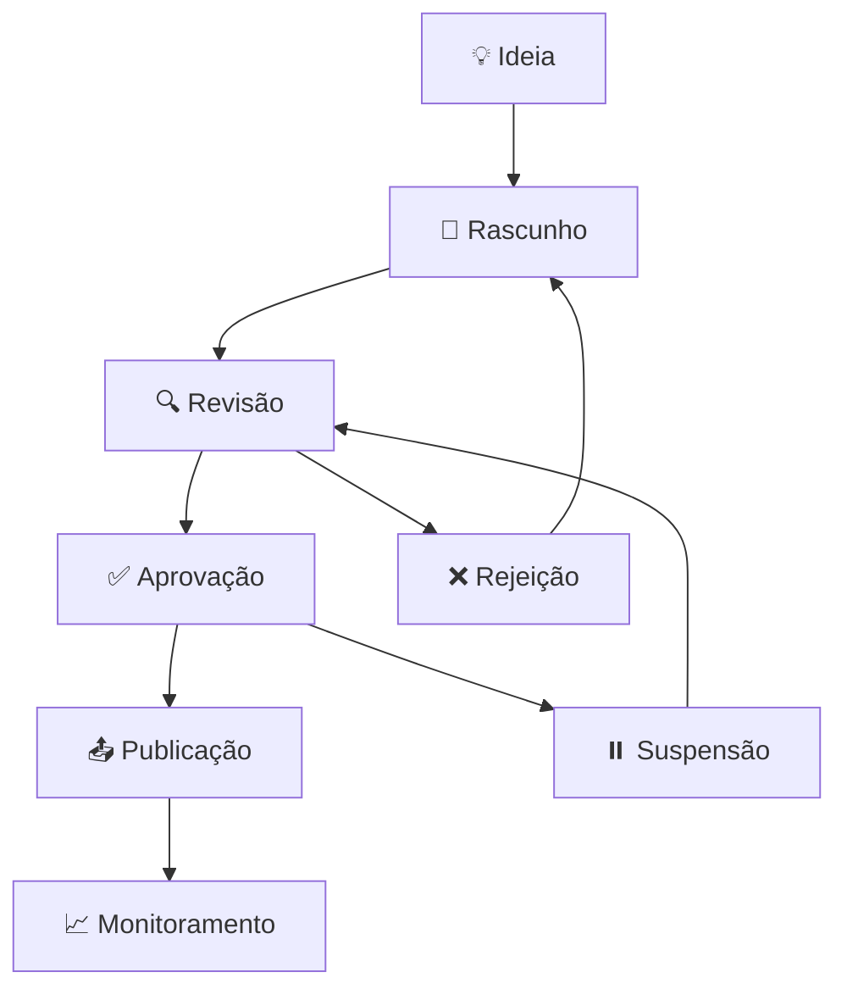

# Fluxo de Trabalho Editorial - Modelo Projeto Conteúdo

## 🎯 Visão Geral

Este documento define o fluxo de trabalho completo para produção de conteúdo educacional, desde a concepção até a publicação. O processo é otimizado para eficiência, qualidade e conformidade com padrões editoriais.

## 📊 Pipeline Editorial

## 🚀 Fases do Processo

### Fase 1: 💡 Ideias e Rascunhos
**Localização**: `2_conteudo/01_ideias_e_rascunhos/`
**Duração estimada**: 1-3 dias
**Responsável**: Autor/Redator

#### Atividades
- [ ] **Brainstorming** de ideias de conteúdo
- [ ] **Pesquisa inicial** sobre o tópico
- [ ] **Definição do público-alvo** e objetivos
- [ ] **Criação do rascunho** usando templates
- [ ] **Primeira revisão** de estrutura e conteúdo

#### Entregáveis
- [ ] Arquivo Markdown com rascunho
- [ ] Definição clara do público-alvo
- [ ] Objetivos do conteúdo definidos
- [ ] Estrutura básica preenchida

#### Critérios de Aprovação
- [ ] Tópico relevante para o público-alvo
- [ ] Estrutura seguindo template apropriado
- [ ] Conteúdo inicial com qualidade básica
- [ ] Objetivos claros e mensuráveis

### Fase 2: 🔍 Em Revisão
**Localização**: `2_conteudo/02_em_revisao/`
**Duração estimada**: 2-5 dias
**Responsável**: Revisor/Editor

#### Atividades
- [ ] **Revisão de conteúdo** (gramática, clareza, precisão)
- [ ] **Verificação de conformidade** com padrões editoriais
- [ ] **Validação técnica** de informações
- [ ] **Aplicação do checklist de sanidade**
- [ ] **Sugestões de melhoria** e correções

#### Entregáveis
- [ ] Conteúdo revisado e corrigido
- [ ] Relatório de revisão com sugestões
- [ ] Aplicação completa do checklist de sanidade
- [ ] Validação de conformidade legal (quando aplicável)

#### Critérios de Aprovação
- [ ] Gramática e ortografia corretas
- [ ] Informações técnicas precisas
- [ ] Estrutura consistente com templates
- [ ] Aplicabilidade prática verificada
- [ ] Conformidade legal validada

### Fase 3: ✅ Pronto para Publicar
**Localização**: `2_conteudo/03_pronto_para_publicar/`
**Duração estimada**: 1-2 dias
**Responsável**: Editor Chefe/Gestor

#### Atividades
- [ ] **Aprovação final** do conteúdo
- [ ] **Configuração de metadados** (tags, categorias, etc.)
- [ ] **Preparação para publicação** (formatação final)
- [ ] **Teste de integração** com sistemas
- [ ] **Agendamento de publicação**

#### Entregáveis
- [ ] Conteúdo aprovado e finalizado
- [ ] Metadados configurados
- [ ] Formatação final aplicada
- [ ] Cronograma de publicação definido

#### Critérios de Aprovação
- [ ] Aprovação do editor chefe
- [ ] Metadados completos e corretos
- [ ] Formatação consistente
- [ ] Integração testada e funcionando
- [ ] Cronograma de publicação definido

### Fase 4: 📤 Publicado
**Localização**: `2_conteudo/04_publicado/`
**Duração estimada**: Contínua
**Responsável**: Sistema/Equipe

#### Atividades
- [ ] **Publicação** em plataformas definidas
- [ ] **Distribuição** para canais apropriados
- [ ] **Monitoramento** de engajamento
- [ ] **Coleta de feedback** dos usuários
- [ ] **Atualizações** conforme necessário

#### Entregáveis
- [ ] Conteúdo publicado e acessível
- [ ] Relatórios de distribuição
- [ ] Métricas de engajamento
- [ ] Feedback coletado e analisado

#### Critérios de Sucesso
- [ ] Publicação bem-sucedida
- [ ] Acessibilidade verificada
- [ ] Engajamento dentro do esperado
- [ ] Feedback positivo dos usuários

## 🔄 Fluxos de Exceção

### Rejeição de Conteúdo
**Quando**: Conteúdo não atende aos critérios de qualidade
**Ação**: Retorno para fase de rascunho
**Responsável**: Revisor/Editor

#### Processo
1. **Identificação** de problemas críticos
2. **Comunicação** ao autor com feedback detalhado
3. **Retorno** para `01_ideias_e_rascunhos/`
4. **Revisão** dos critérios e requisitos
5. **Retrabalho** do conteúdo

### Suspensão Temporária
**Quando**: Necessidade de pausa no processo
**Ação**: Movimento para status suspenso
**Responsável**: Gestor do projeto

#### Processo
1. **Identificação** da necessidade de suspensão
2. **Comunicação** à equipe
3. **Documentação** do motivo e prazo
4. **Retomada** quando apropriado

## 📋 Checklists por Fase

### Checklist: Ideias e Rascunhos
- [ ] **Tópico definido** e relevante
- [ ] **Público-alvo** claramente identificado
- [ ] **Objetivos** específicos e mensuráveis
- [ ] **Template apropriado** selecionado
- [ ] **Estrutura básica** preenchida
- [ ] **Pesquisa inicial** realizada
- [ ] **Primeira versão** criada

### Checklist: Em Revisão
- [ ] **Gramática e ortografia** verificadas
- [ ] **Informações técnicas** validadas
- [ ] **Estrutura** consistente com templates
- [ ] **Aplicabilidade** das instruções testada
- [ ] **Conformidade legal** verificada
- [ ] **Checklist de sanidade** aplicado
- [ ] **Sugestões de melhoria** implementadas

### Checklist: Pronto para Publicar
- [ ] **Aprovação final** obtida
- [ ] **Metadados** completos e corretos
- [ ] **Formatação** consistente aplicada
- [ ] **Integração** testada e funcionando
- [ ] **Cronograma** de publicação definido
- [ ] **Backup** do conteúdo realizado

### Checklist: Publicado
- [ ] **Publicação** realizada com sucesso
- [ ] **Acessibilidade** verificada
- [ ] **Distribuição** para canais apropriados
- [ ] **Monitoramento** configurado
- [ ] **Feedback** sendo coletado
- [ ] **Métricas** sendo acompanhadas

## ⏱️ Cronograma Padrão

### Cronograma Semanal
- **Segunda-feira**: Revisão de conteúdo da semana anterior
- **Terça-feira**: Desenvolvimento de novos rascunhos
- **Quarta-feira**: Revisão e correção de conteúdo
- **Quinta-feira**: Aprovação e preparação para publicação
- **Sexta-feira**: Publicação e monitoramento

### Cronograma Mensal
- **Semana 1**: Planejamento e ideias
- **Semana 2**: Desenvolvimento e rascunhos
- **Semana 3**: Revisão e correção
- **Semana 4**: Aprovação e publicação

## 🎯 Métricas de Performance

### Métricas de Produtividade
- **Conteúdo produzido** por semana/mês
- **Tempo médio** por fase do processo
- **Taxa de aprovação** na primeira revisão
- **Tempo de ciclo** completo (ideia → publicação)

### Métricas de Qualidade
- **Taxa de rejeição** por fase
- **Feedback positivo** dos usuários
- **Conformidade** com padrões editoriais
- **Aplicabilidade** verificada

### Métricas de Engajamento
- **Visualizações** do conteúdo
- **Tempo de leitura** médio
- **Compartilhamentos** e referências
- **Feedback** e comentários

## 🔧 Ferramentas e Automações

### Ferramentas de Produção
- **Editor Markdown**: VS Code, Typora, ou similar
- **Templates**: Arquivos em `1_configuracao/templates_conteudo.md`
- **Checklists**: Aplicação sistemática de verificações
- **Prompts de IA**: Otimização da geração de conteúdo

### Ferramentas de Revisão
- **Verificação gramatical**: Grammarly, LanguageTool
- **Verificação de plágio**: Copyscape, Turnitin
- **Validação técnica**: Consulta a especialistas
- **Checklist de sanidade**: Aplicação sistemática

### Ferramentas de Publicação
- **Notion**: Plataforma principal de gestão
- **Scripts de automação**: Publicação automática
- **Sistemas de monitoramento**: Acompanhamento de métricas
- **Ferramentas de distribuição**: Canais de comunicação

## 📚 Documentação e Suporte

### Documentação Necessária
- **Templates atualizados**: Manutenção dos padrões
- **Checklists revisados**: Melhoria contínua dos processos
- **Métricas documentadas**: Acompanhamento de performance
- **Lições aprendidas**: Registro de melhorias

### Suporte à Equipe
- **Treinamento**: Capacitação nos processos
- **Mentoria**: Acompanhamento de novos membros
- **Feedback contínuo**: Melhoria dos processos
- **Compartilhamento**: Lições aprendidas

## 🚨 Troubleshooting

### Problemas Comuns

#### Conteúdo de Baixa Qualidade
**Sintoma**: Rejeição frequente na revisão
**Solução**: 
- Revisar templates e instruções
- Melhorar treinamento da equipe
- Aplicar checklist de sanidade mais rigorosamente

#### Atrasos no Cronograma
**Sintoma**: Conteúdo não entregue no prazo
**Solução**:
- Revisar estimativas de tempo
- Identificar gargalos no processo
- Ajustar cronograma conforme necessário

#### Problemas de Integração
**Sintoma**: Conteúdo não funciona após publicação
**Solução**:
- Melhorar testes de integração
- Documentar requisitos técnicos
- Implementar validações automáticas

## 📈 Melhoria Contínua

### Revisão Mensal
- **Análise de métricas** de performance
- **Identificação de gargalos** no processo
- **Sugestões de melhoria** da equipe
- **Atualização de processos** conforme necessário

### Revisão Trimestral
- **Avaliação completa** do fluxo de trabalho
- **Atualização de templates** e checklists
- **Treinamento adicional** da equipe
- **Implementação de melhorias** significativas

### Revisão Anual
- **Revisão estratégica** do processo editorial
- **Atualização de ferramentas** e tecnologias
- **Reformulação de métricas** de sucesso
- **Planejamento de melhorias** de longo prazo

---

**Versão**: 1.0.0  
**Última atualização**: Dezembro 2024  
**Status**: Em uso ativo
